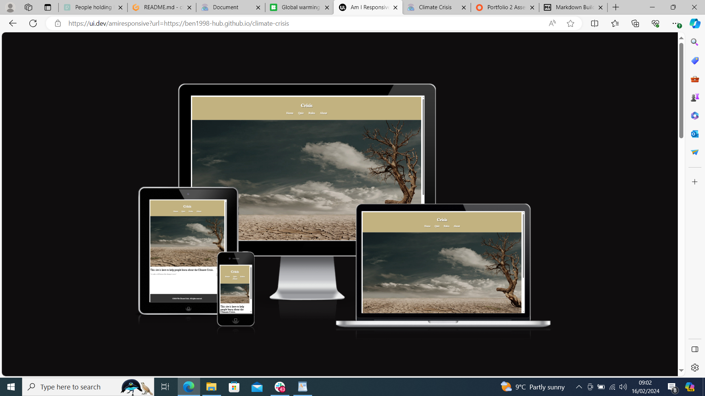
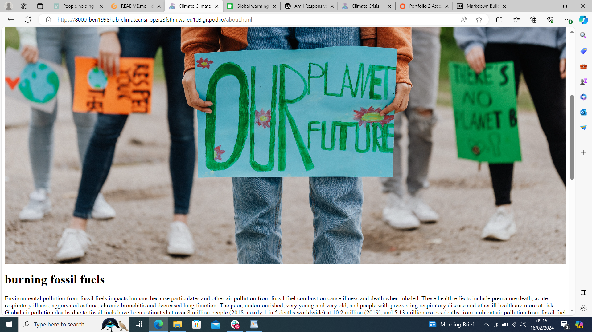
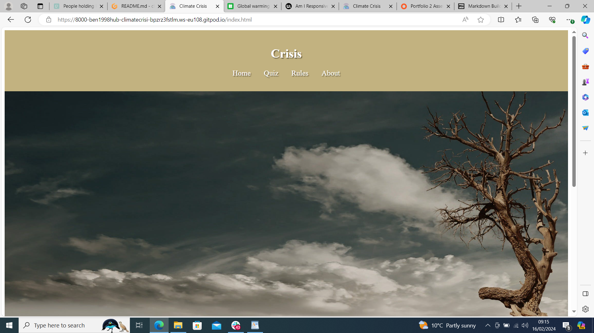
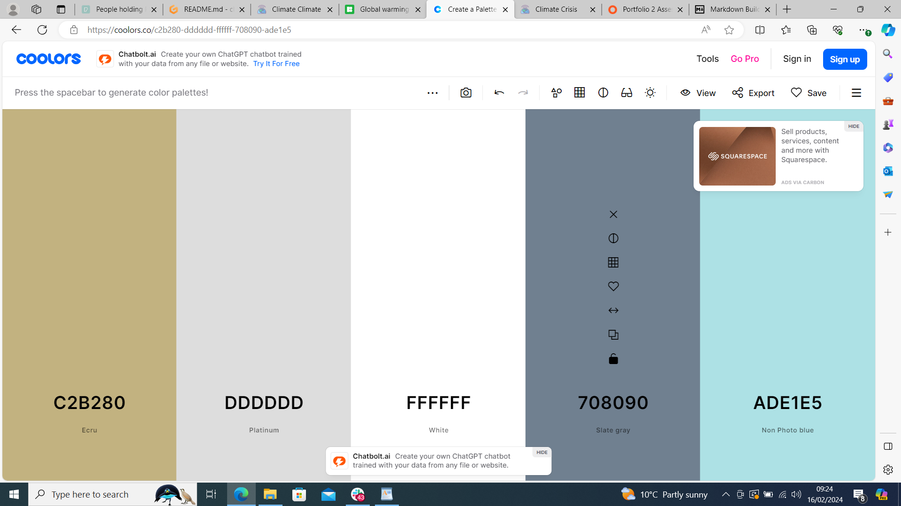
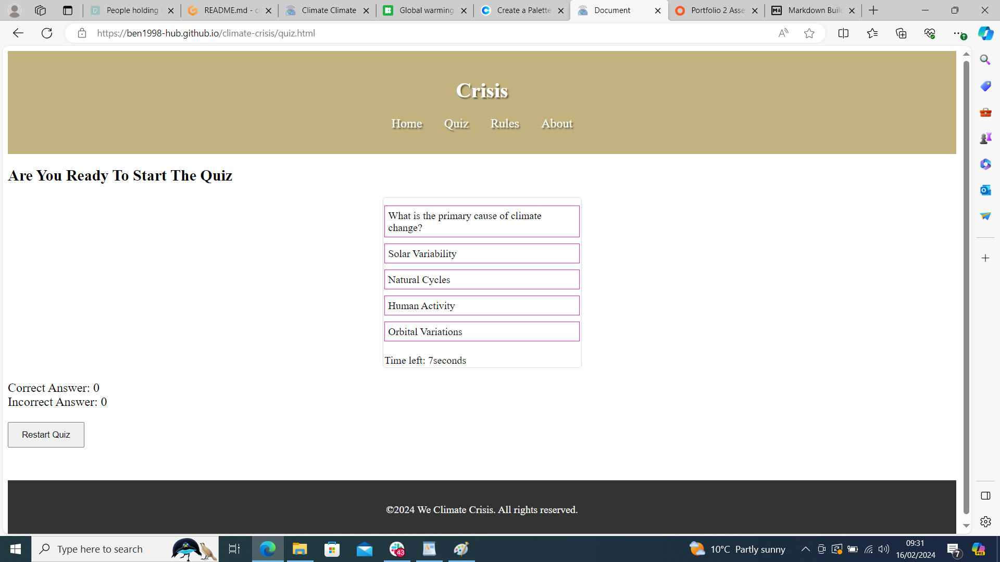

# [CLIMATE CRISIS](https://ben1998-hub.github.io/climate-crisis)
This project is responsive front-end web application about the climate crisis and there's even a really fun quiz game to help people learn and under stand how important gobal warming is to us all!

Am I Responsive" website.
Here's my deployed site as an example:
https://ui.dev/amiresponsive?url=https://ben1998-hub.github.io/climate-crisis

## UX
## colour Schmeme
the design of this projected was inspired by climate change its self from the dusty sandy desert colour on the nav bar or through the multiple pictures through out this sit

-  rgb(194, 178, 128);` used for primary text.
-  #ddd;` used for primary highlights.
- ` #fff; used for secondary text.
- `rgba(0, 0, 0, 0.5);used for secondary highlights.

## Features

Features in this site are an interactive nav bar, a quiz game with a count down of 10 sconds and a rules section.

Also there is many more features on this project such as a restart button, and an about section that educate people on global warming

### Future Features

If i had more time and was a little bit better i would have a datebase so users could keep a track of there score and try and beat it.

Also id love to have a comment sction so the community could more all in one place interacting with each other.

## Tools & Technologies Used

- [HTML](https://en.wikipedia.org/wiki/HTML) used for the main site content.
- [CSS](https://en.wikipedia.org/wiki/CSS) used for the main site design and layout.
- 
- [JavaScript](https://www.javascript.com) used for user interaction on the site.

- [GitHub](https://github.com) used for secure online code storage.
- [GitHub Pages](https://pages.github.com) used for hosting the deployed front-end site.
- [Gitpod](https://gitpod.io) used as a cloud-based IDE for development.

## Testing

For all testing, please refer to the [TESTING.md](TESTING.md) file.

## Deployment

The site was deployed to GitHub Pages. The steps to deploy are as follows:

- In the [GitHub repository](https://github.com/ben1998-hub/climate-crisis), navigate to the Settings tab 

The live link can be found [here](https://ben1998-hub.github.io/climate-crisis)

### Local Deployment

This project can be cloned or forked in order to make a local copy on your own system.

#### Cloning

You can clone the repository by following these steps:

1. Go to the [GitHub repository](https://github.com/ben1998-hub/climate-crisis) 
2. Locate the Code button above the list of files and click it 
3. Select if you prefer to clone using HTTPS, SSH, or GitHub CLI and click the copy button to copy the URL to your clipboard
4. Open Git Bash or Terminal
5. Change the current working directory to the one where you want the cloned directory
6. In your IDE Terminal, type the following command to clone my repository:
	- `git clone https://github.com/ben1998-hub/climate-crisis.git`
7. Press Enter to create your local clone.

Alternatively, if using Gitpod, you can click below to create your own workspace using this repository.

Please note that in order to directly open the project in Gitpod, you need to have the browser extension installed.
A tutorial on how to do that can be found [here](https://www.gitpod.io/docs/configure/user-settings/browser-extension).

#### Forking

By forking the GitHub Repository, we make a copy of the original repository on our GitHub account to view and/or make changes without affecting the original owner's repository.
You can fork this repository by using the following steps:

1. Log in to GitHub and locate the [GitHub Repository](https://github.com/ben1998-hub/climate-crisis)
2. At the top of the Repository (not top of page) just above the "Settings" Button on the menu, locate the "Fork" Button.
3. Once clicked, you should now have a copy of the original repository in your own GitHub account!

| Source | Location | Notes |
| --- | --- | --- |
| [Markdown Builder](https://tim.2bn.dev/markdown-builder) | README and TESTING | tool to help generate the Markdown files |
| [Chris Beams](https://chris.beams.io/posts/git-commit) | version control | "How to Write a Git Commit Message" |
| [W3Schools](https://www.w3schools.com/howto/howto_js_topnav_responsive.asp) | entire site | responsive HTML/CSS/JS navbar |
| [W3Schools](https://www.w3schools.com/howto/howto_css_modals.asp) | contact page | interactive pop-up (modal) |
| [W3Schools](https://www.w3schools.com/css/css3_variables.asp) | entire site | how to use CSS :root variables |

| [StackOverflow](https://stackoverflow.com/a/2450976) | quiz page | Fisher-Yates/Knuth shuffle in JS |
| [YouTube](https://www.youtube.com/watch?v=YL1F4dCUlLc) | leaderboard | using `localStorage()` in JS for high scores |
| [YouTube](https://www.youtube.com/watch?v=u51Zjlnui4Y) | PP3 terminal | tutorial for adding color to the Python terminal |

## media 

| Source | Location | Type | Notes |
| --- | --- | --- | --- |
| [icons8](https://icons8.com/icons/set/global-warming) | entire site |  | favicon on all pages |
| [Lorem Picsum](https://picsum.photos) | home page | image | hero image background |

| [Pixabay](https://pixabay.com) | gallery page | image | group of photos for gallery |

### Acknowledgements

https://icons8.com/icons/set/global-warming

- I would like to thank my Code Institute mentor, [Tim Nelson](https://github.com/TravelTimN) for their support throughout the development of this project.
- I would like to thank the [Code Institute](https://codeinstitute.net) tutor team for their assistance with troubleshooting and debugging some project issues.
- I would like to thank the [Code Institute Slack community](https://code-institute-room.slack.com) for the moral support; it kept me going during periods of self doubt and imposter syndrome.
- I would like to thank my brother (tom), for believing in me, and allowing me to make this transition into software development.
- I would like to thank my employer, for supporting me in my career development change towards becoming a software developer.

And I really could not of done this with out TIM NELSON! i know i've already mention tim but i really mean it thanks. 
### Personal Admission

- At the start of pp2 I thought that javascript would be a nice and lovely language to learn oh how wrong i was ;0
-I would also like to say I would write the README.md and the TESTING.md through out the project and not leave it all to the end.
-The most important things for me now wouldn't be some much about the code it's self but more about planing, order and structure when  building a project.
-I did think until I got to this point it was all about the code if I could go back I would do the things above way more and better!
-I'd like to thank code instuide for this opportunitty it's been such a learning curve thank you.