# Testing

Return back to the [README.md](README.md) file.

## Code Validation

### HTML

I have used the recommended [HTML W3C Validator](https://validator.w3.org) to validate all of my HTML files.

- 

Sample HTML code validation documentation (tables are extremely helpful!):

| Page | W3C URL | Screenshot | Notes |
| --- | --- | --- | --- |
| Home | [W3C](https://validator.w3.org/nu/?doc=https%3A%2F%2Fben1998-hub.github.io%2Fclimate-crisis%2Findex.html) | 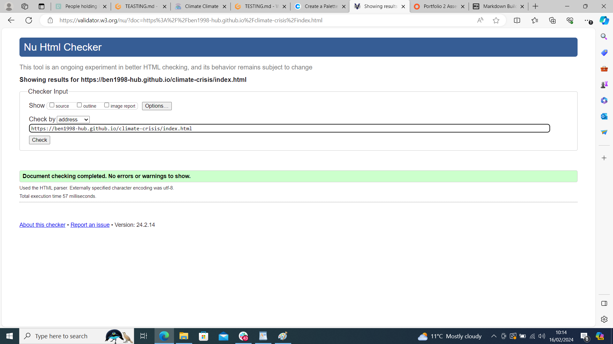 | Section lacks header h2-h6 warning |
| about | [W3C](https://validator.w3.org/nu/?doc=https%3A%2F%2Fben1998-hub.github.io%2Fclimate-crisis%2Fcontact.html) | 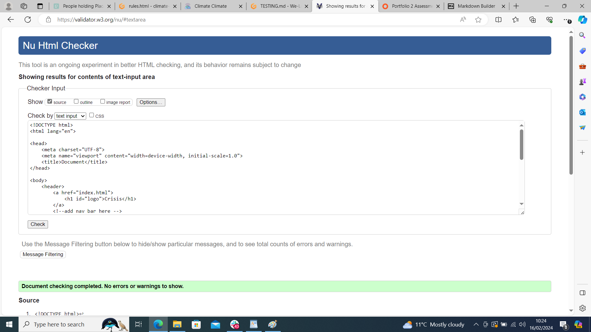 | obsolete iframe warnings |
| Quiz | [W3C](https://validator.w3.org/nu/?doc=https%3A%2F%2Fben1998-hub.github.io%2Fclimate-crisis%2Fquiz.html) | 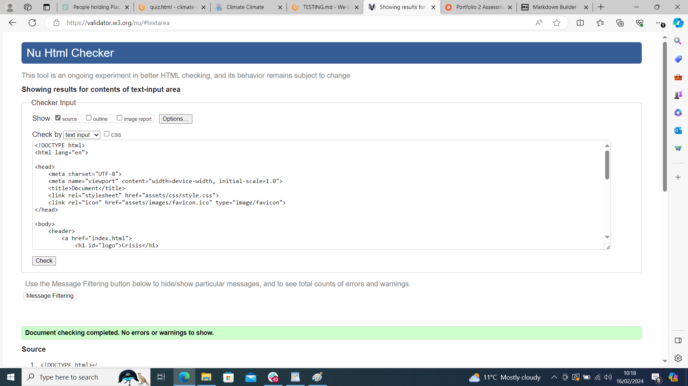 | Pass: No Errors |
| rules | n/a | 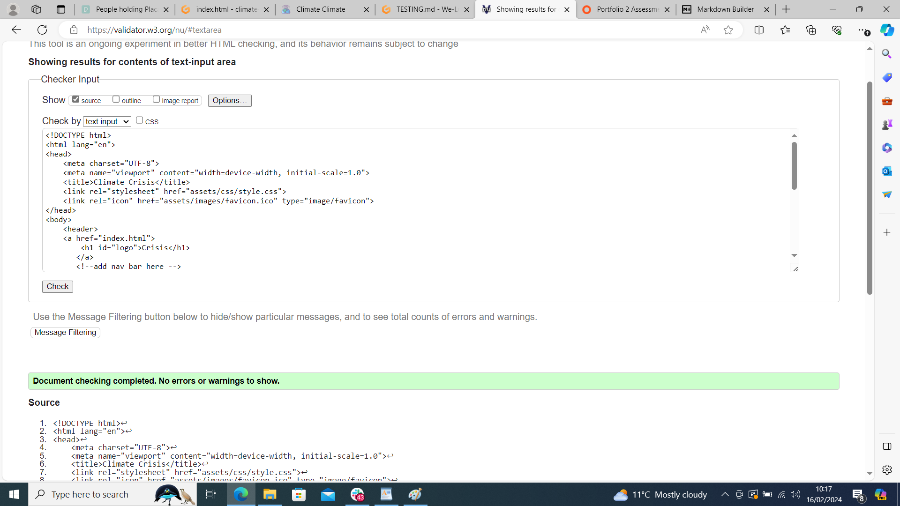 | Duplicate IDs found, and fixed |
Errors |

### CSS

- 

| File | Jigsaw URL | Screenshot | Notes |
| --- | --- | --- | --- |
| style.css | [Jigsaw](https://jigsaw.w3.org/css-validator/validator?uri=https%3A%2F%2Fben1998-hub.github.io%2Fclimate-crisis) 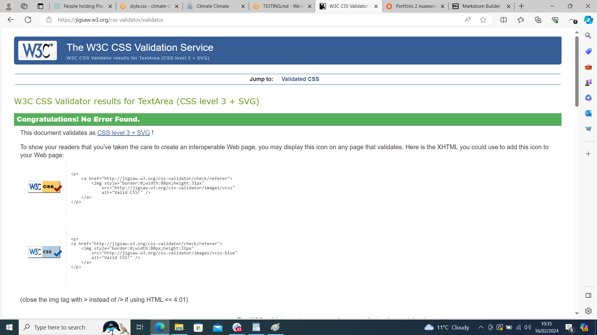
| x | x | x | repeat for all remaining CSS files |

### JavaScript

I have used the recommended [JShint Validator](https://jshint.com) to validate all of my JS files.
🛑🛑

If using modern JavaScript (ES6) methods, then make sure to include the following
line at the very top of every single JavaScript file (this should remain in your files for submission):

    /* jshint esversion: 11 */

    /* jshint esversion: 11, jquery: true */

This allows the JShint validator to recognize modern ES6 methods, such as:
`let`, `const`, `template literals`, `arrow functions (=>)`, etc.

**IMPORTANT**: External resources

Sometimes we'll write JavaScript that imports variables from other files, such as an array of questions
from `questions.js`, which are used within the main `script.js` file elsewhere.
If that's the case, the JShint validation tool doesn't know how to recognize unused variables
that would normally be imported locally in your code.
These warnings are acceptable to showcase on your screenshots.

The same thing applies when using external libraries such as Stripe, Leaflet, Bootstrap, Materialize, etc..
To instantiate these components, we need to use their respective declarator.
Again, the JShint validation tool would flag these as undefined/unused variables.
These warnings are acceptable to showcase on your screenshots.

Sample JS code validation documentation (tables are extremely helpful!):

| File | Screenshot | Notes |
| --- | --- | --- |
| script.js | 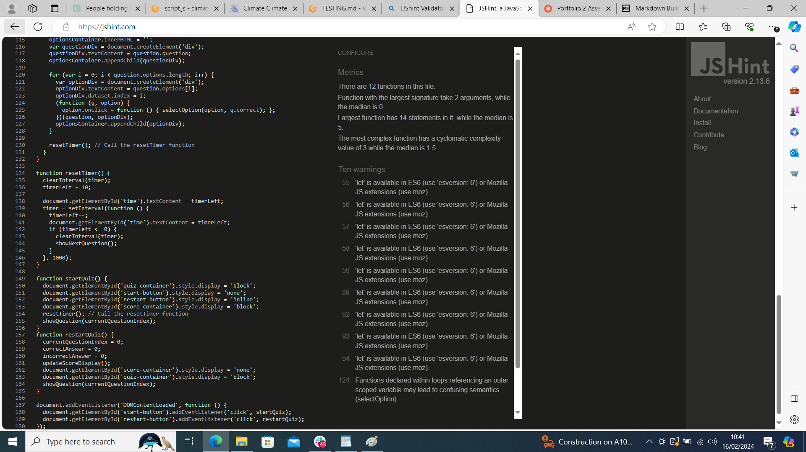 | Unused variables from external files |

| x | x | x | repeat for all remaining JavaScript files |

## Browser Compatibility

Use this space to discuss testing the live/deployed site on various browsers.

Consider testing at least 3 different browsers, if available on your system.

Recommended browsers to consider:
- [Chrome](https://www.google.com/chrome)
- [Firefox (Developer Edition)](https://www.mozilla.org/firefox/developer)
- [Edge](https://www.microsoft.com/edge)
- [Safari](https://support.apple.com/downloads/safari)
- [Brave](https://brave.com/download)
- [Opera](https://www.opera.com/download)

I've tested my deployed project on multiple browsers to check for compatibility issues.

| Browser | Home | About | Contact | etc | Notes |
| --- | --- | --- | --- | --- | --- |
| Chrome |  | 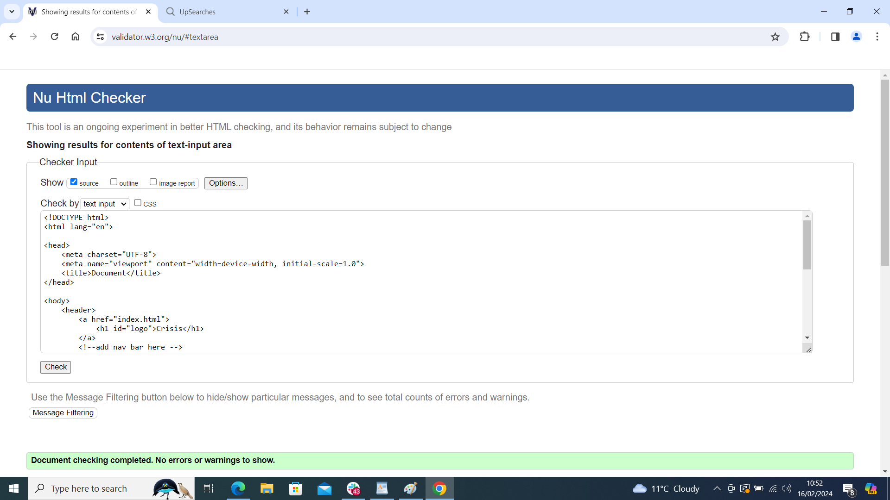 |  |  | Works as expected |
| Firefox | 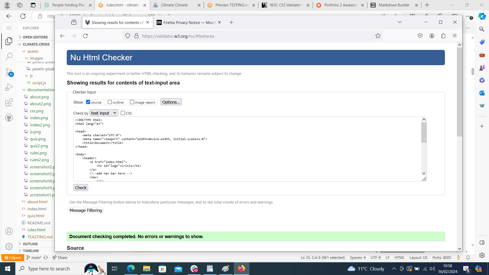 | 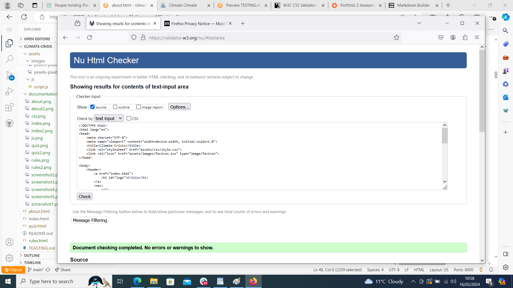 |  |  | Works as expected |
| Edge |  |  |  |  | Works as expected |

| repeat for any other tested browsers | x | x | x | x | x |

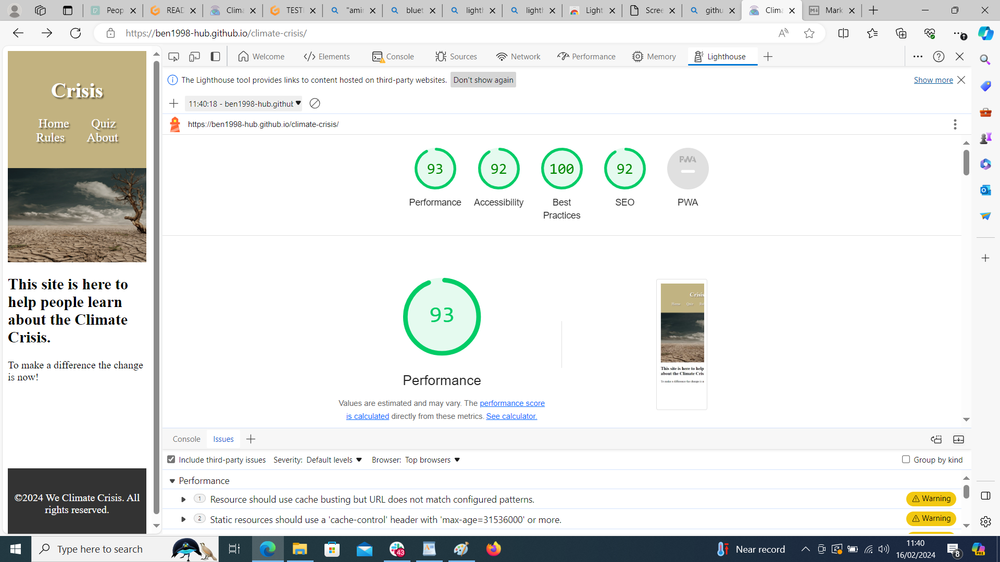

responsives from lighthouse 

I've tested my deployed project on multiple devices to check for responsiveness issues.

| Device | Home | About | Contact | etc | Notes |
| --- | --- | --- | --- | --- | --- |
| Mobile (DevTools) | 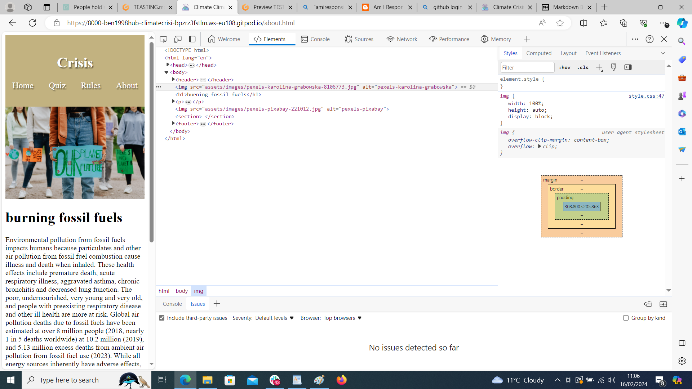 |  | 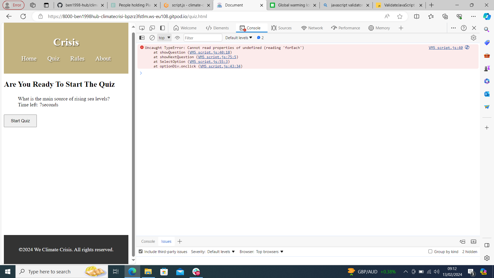 | 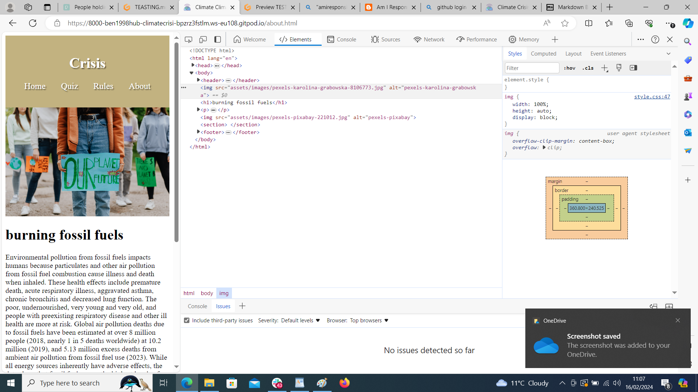 | Works as expected |
| Tablet (DevTools) |  |  | 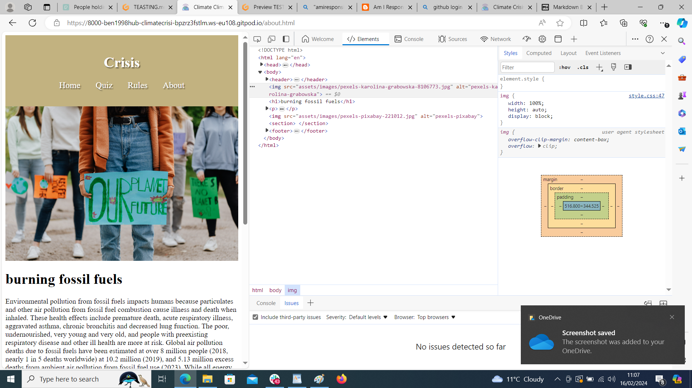 | 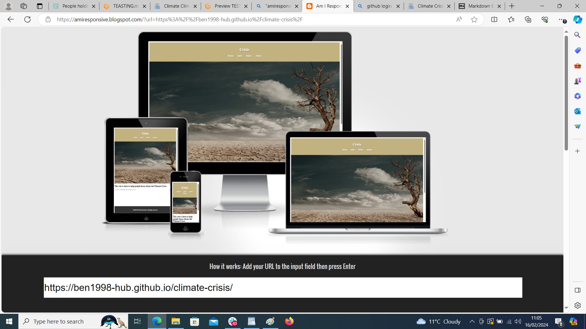 || 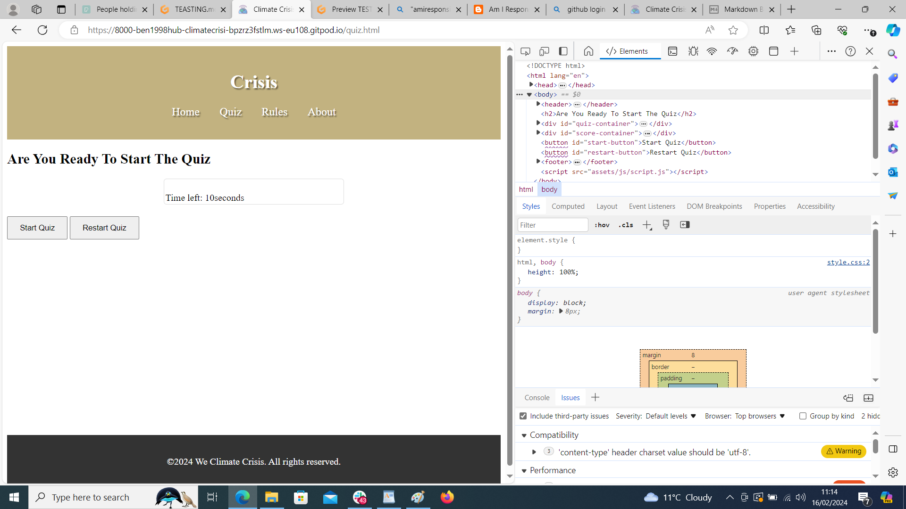 |  | 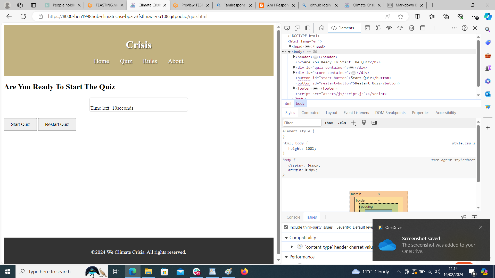 Works as expected |

| repeat for any other tested browsers | x | x | x | x | x |

## Bugs 
There are no bugs to my knowledge. 

